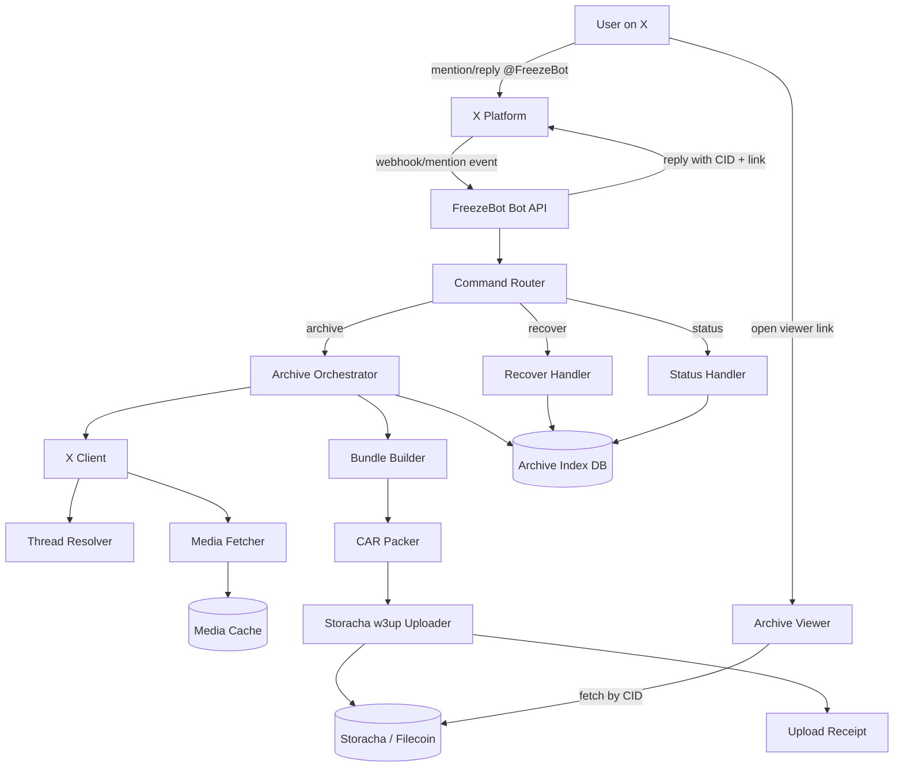
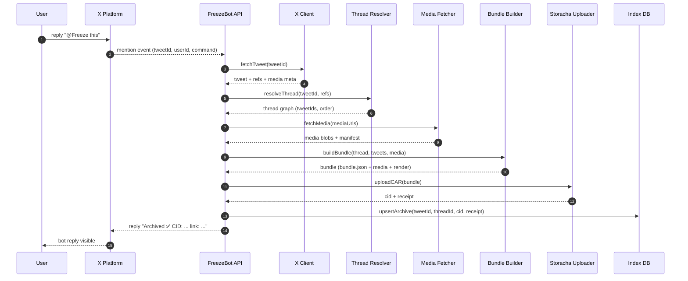
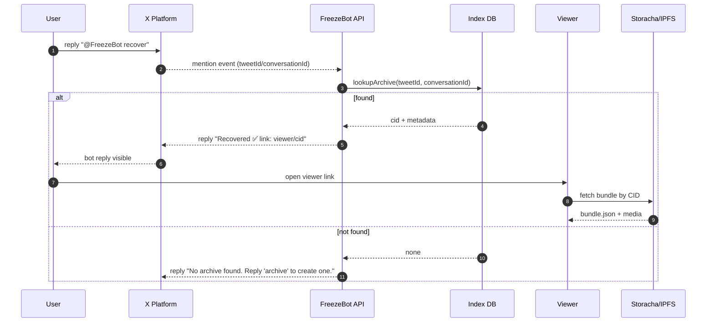
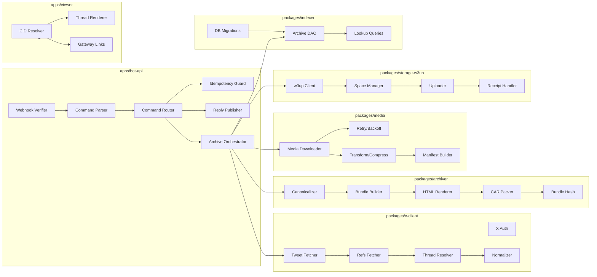

# FreezeBot

**FreezeBot** preserves X (Twitter) content permanently on decentralized storage.
When posts disappear, Freeze remembers.

Reply/mention the bot to archive any post, thread, or media with cryptographic proof (CID).
When content is deleted, anyone can ask to recover it with `recover`.

> **Repo:** [https://github.com/pranavvdesai/FreezeBot](https://github.com/pranavvdesai/FreezeBot)
> **Product Documentation:** [https://docs.google.com/document/d/1KMNT-0kf_Uqh5KJ02EPdwNbCEaABqNQ15Q4FileZteI/edit?usp=sharing]

---

## Table of Contents

- [What it does](#what-it-does)
- [User commands](#user-commands)
- [High Level Architecture](#high-level-architecture)
- [Flows](#flows)
- [Low Level Design](#low-level-design)
- [Local development](#local-development)
- [Deployment](#deployment)
- [Troubleshooting](#troubleshooting)
- [Security & privacy](#security--privacy)
- [Contributing](#contributing)


---

## What it does

FreezeBot archives:

* **Single posts** (text + metadata)
* **Full threads** (parents, replies-in-thread, quoted context when available)
* **Media** (images, video, GIFs) + link previews
* **Conversation context** (optional mode: capture surrounding replies)
* **Proof**: each archive returns a **CID** (content-addressed integrity)

Retrieval:

* Anyone can request a recovery link for deleted content using `recover`
* A clean **Archive Viewer** renders the content with original formatting
* Archives are accessible via **IPFS gateways** (standard HTTPS)

---

## User commands

Reply or mention the bot:

* `@Freeze this`
  Uploads the target post. If it’s part of a thread, captures the thread context.

* `@Freeze this thread`
  Force-captures thread parents + the author’s thread chain.

* `@Freeze recover`
  If the original content is deleted/unavailable, bot replies with the archive link (if exists).

* `@Freeze status`
  Returns whether the tweet/thread is already archived + CID(s).

---

## High Level Architecture



### Components

* **X Ingestion Layer**

  * Receives mention events (bot mentions / replies).
  * Fetches post/thread details using official X endpoints available to your app.
  * Normalizes content into an internal canonical format.

* **Thread Resolver**

  * Builds a “thread graph”:

    * root → parents chain → child replies in thread (where applicable)
    * quote-tweet context (optional)
  * Produces a deterministic archive bundle.

* **Media Fetcher**

  * Downloads images/video variants
  * Captures link previews (OpenGraph) and embeds
  * Creates a normalized media manifest

* **Storacha Uploader (w3up)**

  * Uploads the archive bundle to Storacha
  * Returns **CID** + upload receipt metadata
  * Supports **user-owned spaces** via UCAN delegation (optional advanced mode)

* **Archive Index (DB)**

  * Stores mapping: `tweetId/threadId → cid + metadata`
  * Enables `recover` and de-duplication

* **Archive Viewer (Web)**

  * Renders archived content by CID
  * Preserves formatting, media, and thread structure

---

## Flows

### 1) Mention-to-Archive



### 2) Recover after deletion



---

## Low Level Design



---

## Local development

### Prereqs

* Node 18+
* pnpm (recommended) or npm
* A database (Postgres recommended)

### Setup

```bash
git clone https://github.com/pranavvdesai/FreezeBot.git
cd FreezeBot
pnpm install
cp .env.example .env
pnpm dev
```

### Environment variables (example)

* `X_APP_KEY=...`
* `X_APP_SECRET=...`
* `X_WEBHOOK_SECRET=...`
* `DATABASE_URL=postgres://...`
* `W3UP_EMAIL=...` (if using email-based auth flow)
* `VIEWER_BASE_URL=http://localhost:3000`

---

## Deployment

* Run `bot-api` as a small stateless service
* Run `viewer` as a static + SSR app (or static only, depending on your viewer design)
* Use Postgres for the index
* Store minimal secrets (X + w3up) in your platform secret manager

---

## Troubleshooting

**Bot doesn’t respond to mentions**

* Verify webhook/event subscription is active
* Check signature verification and webhook secret
* Inspect logs for command parsing issues

**Thread is incomplete**

* Some context may not be available via the endpoints your app can access
* Ensure resolver fetches referenced tweets (reply-to chain, quote) when IDs are provided
* Add “best-effort” mode: archive what you can, clearly label missing parts in `bundle.json`

**Media fails**

* Retry with exponential backoff
* Persist partial bundle; do not fail the entire archive if a single media fetch fails
* Include `mediaManifest[].error` when a file can’t be fetched

**Duplicate archives**

* Use `IdempotencyGuard`: `(tweetId, commandType)` as a unique key
* Deduplicate by computed stable `bundleHash` before uploading

---

## Security & privacy

* **Integrity**: CID guarantees content integrity (tamper changes CID)
* **Receipts**: store upload receipts metadata with the archive (when available)
* **Access control (optional advanced mode)**:

  * Support user-owned spaces via UCAN delegation for “my archives”
  * For private archives, encrypt the bundle client-side before upload (viewer requires key)


---

## Contributing

* Branch naming:

  * `feat/<name>`
  * `fix/<name>`
  * `chore/<name>`
* Conventional commits:

  * `feat(archiver): thread bundle builder`
  * `fix(media): retry on transient failures`
* PRs should include:

  * What changed and why
  * Any schema changes + migrations
  * Screenshots for viewer UI changes

---
